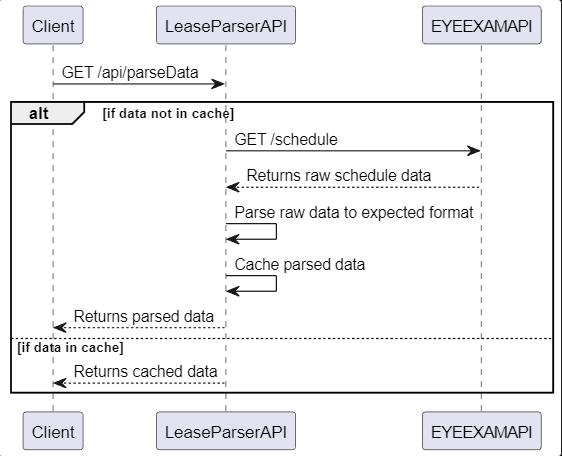

# LeaseParserAPI


LeaseParserAPI is a .NET 6 API that consumes the EYEEXAMAPI, processes raw lease schedule data, and returns it in a structured format.

## Getting Started

These instructions will get you a copy of the project up and running on your local machine for development and testing purposes.

### Prerequisites

- .NET 6.0 SDK
- An IDE or code editor such as Visual Studio 2023, Visual Studio Code, or JetBrains Rider.

### Installing

1. Clone the repository
    ```bash
    git clone https://github.com/your-github-username/LeaseParserAPI.git
    ```
2. Navigate to the project directory
    ```bash
    cd LeaseParserAPI
    ```
3. Restore the .NET packages
    ```bash
    dotnet restore
    ```
4. Build and run the project
    ```bash
    dotnet run
    ```

The API will start running at `https://localhost:5001`.

The url for the eyeexamapi is set in the appsetting.json, this will need to be updated to the actual url.

## Usage

The API has one main route:

- **/parseData**: This route consumes the EYEEXAMAPI, processes the raw lease schedule data, and returns it in the expected structured format.




## Testing

You can run the unit tests for the project by using the following command:
```bash
dotnet test